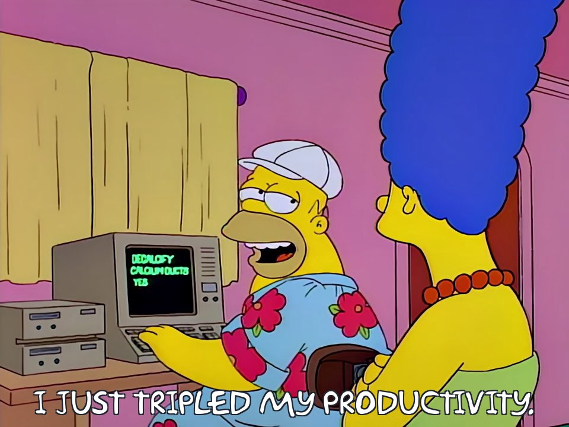

<p align="center">
  
</p>

# agent-pad

A tiny macOS background daemon that turns a Steam Controller into a single-purpose answering machine for Claude Code (or any tmux pane). Tap **A** to send `1` to your Claude window. **B** sends `2`. **Y** sends `3`. The **forward-arrow** button (Start) sends **Enter** and the **left** button (Select) sends **→ (Right arrow)** — so you can accept Claude's autosuggested command and run it without touching your focused window.

## What it's for

Claude Code asks a lot of numbered yes/no/which-of-these questions during long agentic runs, and it also offers autosuggested commands (ghost-text completions) you accept with → and run with Enter. If Claude lives on a side monitor, every interaction means alt-tabbing over, typing a key, and finding your way back. With `agent-pad`, you keep the controller on your desk: tap **A/B/Y** for numbered answers, the **left (Select)** button to accept the autosuggested command (→), and the **forward-arrow (Start)** button to run it (Enter) — all without ever looking away.

## Requirements

- macOS (Apple Silicon or Intel)
- A 2015 Steam Controller with [BLE firmware](https://store.steampowered.com/news/app/353370/view/3931035846865617357), already bonded to your Mac over Bluetooth
- tmux
- Go 1.21+ (for building; or grab a release binary)

## Install

### From source

```sh
git clone https://github.com/hughobrien/agent-pad ~/src/agent-pad
cd ~/src/agent-pad
./bootstrap.sh
```

### From a release tarball (no Go toolchain needed)

```sh
mkdir -p ~/src/agent-pad && cd ~/src/agent-pad
curl -L https://github.com/hughobrien/agent-pad/releases/latest/download/agent-pad_<version>_darwin_arm64.tar.gz | tar -xz
./bootstrap.sh
```

Either way, `bootstrap.sh` installs a launchd agent and loads it. macOS will prompt for Bluetooth access on first run — allow it.

Verify:

```sh
launchctl list | grep agent-pad   # PID + exit code 0 = healthy
tail -f ~/Library/Logs/agent-pad.log
```

## Use

1. Open a tmux window where you run Claude Code.
2. Rename that window so its name ends in `-pad` — `C-b ,` then type e.g. `claude-pad`.
3. Tap A on the controller. The digit `1` lands in that window's active pane. macOS focus stays where it is. The left (Select) button sends `→` to accept Claude's autosuggested command; the forward-arrow (Start) button sends `Enter` to run it.

If no window's name ends in `-pad`, taps are silently dropped. To stop accepting taps, rename the window to anything else.

## Extending button mappings

Open `cmd/agent-pad/main.go`. Add lines to `buttonToDigit`:

```go
var buttonToDigit = []struct {
    mask  uint32
    digit string
}{
    {btnA, "1"},
    {btnB, "2"},
    {btnY, "3"},
    {btnStart, "Enter"},          // forward-arrow: run the command
    {btnSelect, "Right"},         // left button: accept the autosuggestion (→)
    {btnX, "4"},                  // <- send another digit
    {btnRightShoulder, "y"},      // <- or a letter
}
```

The send string is passed straight to `tmux send-keys`, so any tmux key name works — digits and letters, plus named keys like `Enter`, `Right`, `Left`, `Up`, `Down`, `Escape`, `BSpace`, `Tab`. All 18 buttons (face, shoulders, triggers, grips, trackpad clicks, Steam/Start/Select) have constants defined. Rebuild + reload with `./bootstrap.sh`.

## How it works

The interesting part of this project is what it took to get the controller talking on macOS.

**The problem.** macOS routes BLE HID devices through a kernel driver (`IOBluetoothHIDDriver`) that owns the HID interfaces. Userspace can't send HID feature reports — every attempt returns `-1` silently. Without feature reports, the Steam Controller stays in "lizard mode," emulating a global keyboard and mouse: pressing A sends Enter to whatever app has focus, the right trackpad moves the cursor. Useless for our purpose.

**The trick.** The Steam Controller exposes a vendor-defined GATT service (`100f6c32-…`) alongside the standard HID-over-GATT service. CoreBluetooth's `RetrieveConnectedPeripheralsWithServices` returns the controller when queried by the vendor service UUID — *even while it's bonded as HID*. We get parallel access: the kernel handles HID, we own the vendor channel.

**The bytes.** Write `0xC0 0x87 0x03 0x08 0x07 0x00` (with response) to characteristic `100f6c34-…`. That's `[BLE single-segment framing] [SET_SETTINGS] [3-byte arg] [LEFT_TRACKPAD_MODE] [value 0x07]`. Lizard mode goes dark. The disable persists as long as we hold the BLE connection — no heartbeat.

**The input.** Subscribe to GATT notifications on `100f6c33-…`. Reports where `byte[2] == 0x00` carry the full 24-bit button bitmap in bytes 3–5. We edge-detect 0→1 transitions and run `tmux send-keys -t <session:window> <digit>` to deliver the keystroke to the active pane of the first `-pad`-suffixed window.

See [`docs/specs/2026-05-29-agent-pad-design.md`](docs/specs/2026-05-29-agent-pad-design.md) for the full design, the GATT byte tables, and the reconnect/state-machine details. Credit for the protocol reverse engineering goes to [Dennis Hamester](https://dennis-hamester.gitlab.io/scraw/protocol/) and [Stany Marcel's `steamcontroller`](https://github.com/ynsta/steamcontroller).

## Troubleshooting

**`Steam Controller not currently connected to macOS`** — Wake the controller (press any button). The daemon polls every 2 seconds. If it never appears, check System Settings → Bluetooth: the SC should be listed as Connected.

**`tmux not found`** — Re-run `./bootstrap.sh`. Bootstrap resolves tmux's path from your interactive shell and bakes it into the launchd plist (necessary because launchd-spawned processes don't inherit Nix or Homebrew PATH).

**Taps detected in the log but nothing lands in tmux** — Make sure the target window's name ends in `-pad`. Run `tmux list-windows -a` to verify.

**Cursor still moves when I touch the right trackpad** — The disable-lizard write didn't take. Check `~/Library/Logs/agent-pad.log` for `Sent disable-lizard`. If missing, the daemon never reached the discover callback — usually a Bluetooth permission issue.

## Operations

```sh
# Reload after a change
./bootstrap.sh

# Stop
launchctl unload ~/Library/LaunchAgents/agent-pad.plist

# Logs
tail -f ~/Library/Logs/agent-pad.log
```

## Caveats

- Works for the **original 2015 Steam Controller** with BLE firmware (VID `0x28DE`, PID `0x1106`). The newer SC2026 uses a different protocol and won't work with this code.
- The SC must be **bonded to macOS as a HID device** before the daemon runs. The daemon doesn't initiate pairing — it parallel-accesses an already-bonded peripheral. If the device hasn't been added in System Settings → Bluetooth, `RetrieveConnectedPeripheralsWithServices` returns nothing.
- macOS only. The same idea would work on Linux but via `hidraw` and feature reports, without the CoreBluetooth dance.

## History

Originally built in Python with PyObjC, rewritten in Go for single-binary distribution. The Python version is in git history if you're curious about the iteration.

## License

GPL-3.0-or-later. See [LICENSE](LICENSE).
